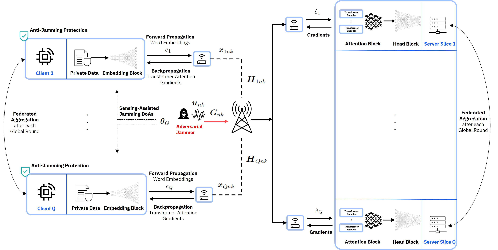

<div align="center">

# R-SFLLM: Jamming Resilient Framework for Split Federated Learning with Large Language Models

[](https://arxiv.org/abs/2407.11654)
[](https://ieeexplore.ieee.org/document/11104091/)

</div>

<div style="margin-bottom: 1em;">
  <strong>Abstract</strong><br>
  Split federated learning (SFL) is a compute-efficient paradigm in distributed machine learning (ML), where components of large ML models are outsourced to remote servers. A significant challenge in SFL, particularly when deployed over wireless channels, is the susceptibility of transmitted model parameters to adversarial jamming that could jeopardize the learning process. This is particularly pronounced for embedding parameters in large language models (LLMs) and vision language models (VLMs), which are learned feature vectors essential for domain understanding. In this paper, rigorous insights are provided into the influence of jamming embeddings in SFL by deriving an expression for the ML training loss divergence and showing that it is upper-bounded by the mean squared error (MSE). Based on this analysis, a physical layer framework is developed for resilient SFL with LLMs (R-SFLLM) over wireless networks. R-SFLLM leverages wireless sensing data to gather information on the jamming directions-of-arrival (DoAs) for the purpose of devising a novel, sensing-assisted anti-jamming strategy while jointly optimizing beamforming, user scheduling, and resource allocation. Extensive experiments using both LLMs and VLMs demonstrate R-SFLLM’s effectiveness, achieving close-to-baseline performance across various natural language processing (NLP) and computer vision (CV) tasks, datasets, and modalities. The proposed methodology further introduces an adversarial training component, where controlled noise exposure significantly enhances the model’s resilience to perturbed parameters during training. The results show that more noise-sensitive models, such as RoBERTa, benefit from this feature, especially when resource allocation is unfair. It is also shown that worst-case jamming in particular translates into worst-case model outcomes, thereby necessitating the need for jamming-resilient SFL protocols.
</div>

<br>

## 📡 Split FL System Design under Adversarial Jamming

<div align="center">


</div>

## 🚀 How to Install & Run

Clone repository and install dependencies

```bash
# clone project
git clone https://gitlab.lrz.de/aces/6g-life/resilience/resilient_sfl.git
cd resilient_sfl

# install resilient_comms and isac packages (contact aladin.djuhera@tum.de or vlad.andrei@tum.de for permissions)
pip install git+https://gitlab.lrz.de/aces/6g-life/resilience/resilient_comms.git
pip install git+https://gitlab.lrz.de/aces/6g-life/integrated_sensing_and_communication.git

# install requirements
pip install -r requirements.txt
```

Run SFL training with default configurations

```bash
# train on CPU
python src/run.py trainer=cpu

# train on GPU
python src/run.py trainer=gpu
```

Run SFL training with chosen experiment configuration from [configs/experiment/](configs/experiment/)

```bash
# Single experiment
python src/run.py -m experiment=experiment.yaml

# Multiple experiments
python src/run.py -m experiment=experiment_1.yaml,experiment_2.yaml

# Multiple similar experiments from a list (e.g. experiment_1.yaml, experiment_2.yaml, ...)
python src/run.py -m experiment='glob(experiment_*)'
```

You can override any parameter from the command line like this

```bash
python src/run.py -m experiment=experiment.yaml trainer.max_epochs=20 datamodule.batch_size=64
```

## 📚 Citation

If you find R-SFLLM useful in your research, please cite:

```bibtex
@article{Djuhera_2025,
  title={R-SFLLM: Jamming Resilient Framework for Split Federated Learning With Large Language Models},
  volume={20},
  ISSN={1556-6021},
  url={http://dx.doi.org/10.1109/TIFS.2025.3594107},
  DOI={10.1109/tifs.2025.3594107},
  journal={IEEE Transactions on Information Forensics and Security},
  publisher={Institute of Electrical and Electronics Engineers (IEEE)},
  author={Djuhera, Aladin and Andrei, Vlad C. and Li, Xinyang and Mönich, Ullrich J. and Boche, Holger and Saad, Walid},
  year={2025},
  pages={8296–8311}
}
```
